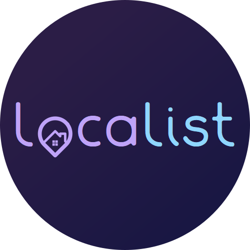

<p align="center">
    
</p>

# Localist

[](https://github.com/mark-rafter/Localist/actions?query=workflow%3A%22Build%22)

## About
Localist is a message board [PWA](https://developer.mozilla.org/en-US/docs/Web/Progressive_web_apps) written in Blazor and ASP.NET Core 5

## Demo
https://localist.herokuapp.com

## Pre-requisites
* [.NET 5](https://dotnet.microsoft.com/download/dotnet/5.0)

OR

* [Docker](https://www.docker.com/get-started)

## Setup

1. Clone repo `git clone git@github.com:mark-rafter/Localist.git`
2. [Setup MongoDB](https://docs.mongodb.com/guides/cloud/connectionstring/) for data storage
3. [Setup imgBB](https://api.imgbb.com/) for image storage
4. [Generate VAPID keys](https://d3v.one/vapid-key-generator/) for push notifications
5. Update [appsettings.json](Server/appsettings.json) with your MongoDB, imgBB, JWT and VAPID credentials.
6. Update [pushNotifications.js](Client/wwwroot/js/pushNotifications.js#L2) with your VAPID public key.
7. Run the API via dotnet `dotnet run -p Server` and navigate to https://localhost:5001/

OR

7. Run the API via docker and navigate to http://localhost:5000/
```
docker build -t localist-app-image .
docker run -it --rm -p 5000:80 --name localist-app-container localist-app-image
```
